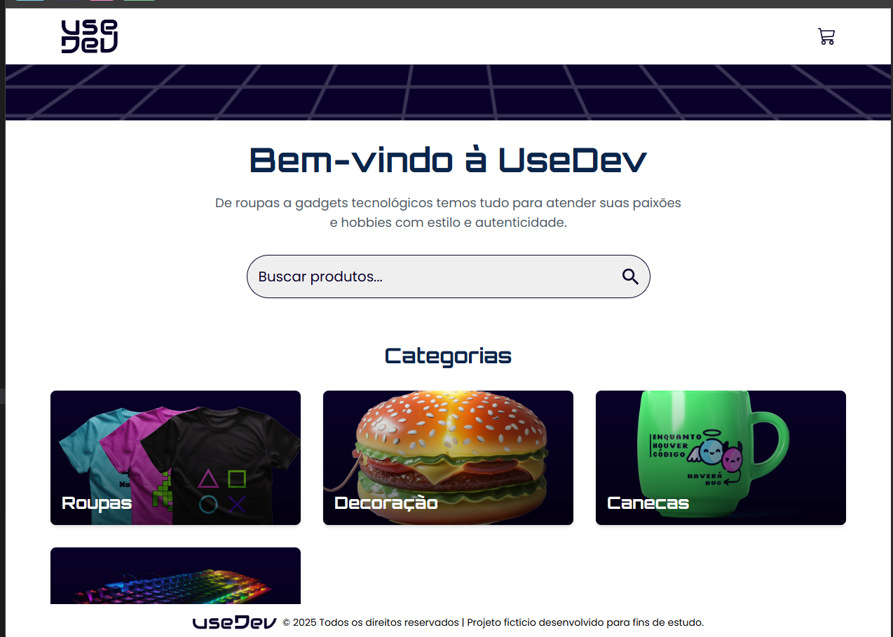
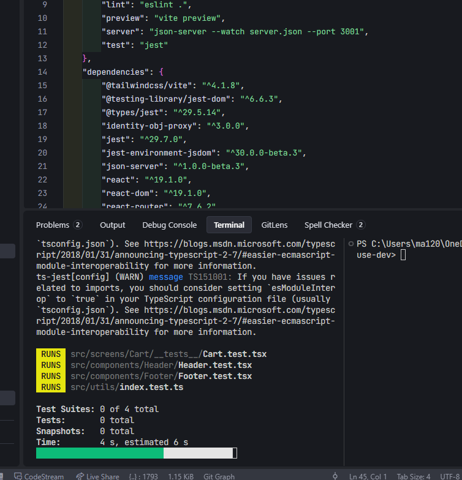

# React + TypeScript + Vite  +  JEST

# Introdução



Este projeto é um template minimalista para iniciar aplicações React utilizando TypeScript e Vite. Ele oferece configuração inicial para Hot Module Replacement (HMR), ESLint com regras básicas e integração facilitada para desenvolvimento moderno em React.

## Sobre o Projeto

- **Frontend:** React com TypeScript
- **Build Tool:** Vite para desenvolvimento rápido e eficiente
- **Lint:** ESLint configurado para garantir qualidade do código
- **Testes:** Suporte para Jest com arquivos mockados
- **Hot Reload:** Atualização instantânea dos componentes durante o desenvolvimento

### Estrutura de Pastas

```
react-use-dev/
├── public/
├── src/
│   ├── components/
│   │   ├── Header/
│   │   │   ├── Header.tsx
│   │   │   └── Header.test.tsx  // Arquivo de para os testes do Header
│   │   ├── Footer/
│   │   │   ├── Footer.tsx
│   │   │   └── Footer.test.tsx // Arquivo
│   ├── hooks/
│   ├── __mocks__/
│   │   └── arquivoMockado.ts
│   ├── screens/
│   │   └── Cart/
│   │       ├── Card.tsx
│   │       └── __tests__/
│   │           └── Card.test.tsx // Arquivo de testes do Card
│   ├── utils/
│   │   ├── index.ts
│   │   └── index.test.ts // Arquivo de testes do index.ts
│   ├── App.tsx
│   └── main.tsx
├── tests/
│   └── App.test.tsx
├── README.md
├── package.json
├── tsconfig.json
└── exemplo.png
```

## Testes com Jest

O projeto utiliza o **Jest** para testes unitários e de integração. Os arquivos de teste ficam na pasta `tests/` e os mocks personalizados na pasta `src/__mocks__/`.

### Como executar os testes

```bash
npm run test
```

### Exemplo de arquivo de teste

```typescript
// tests/App.test.tsx
import { render, screen } from '@testing-library/react';
import App from '../src/App';

test('renderiza o título principal', () => {
  render(<App />);
  const titulo = screen.getByText(/React/i);
  expect(titulo).toBeInTheDocument();
});
```

### Exemplo de arquivo mockado

```typescript
// src/__mocks__/arquivoMockado.ts
export const mockData = {
  id: 1,
  nome: 'Exemplo',
};
```

# Testes da Aplicação

Esta seção detalha a cobertura de testes para os principais componentes da aplicação, garantindo sua funcionalidade, renderização e interatividade.

---

## 1. Testes do Header

### 📍 Localização do Arquivo

-   `src/components/Header/Header.test.tsx` (ou o caminho correspondente no seu projeto)

### 🎯 Objetivo

O principal objetivo desta suíte de testes é garantir que o componente `Header` seja renderizado corretamente e que sua interatividade (como links de navegação e botões) funcione como esperado em diferentes cenários.

### 🧪 Casos de Teste Detalhados

#### 1.1. Renderização Inicial
-   **Descrição:** Verifica se o componente `Header` é montado na tela sem erros.
-   **O que é testado:** A presença do componente no DOM, geralmente buscando por um `role="banner"`.
-   **Exemplo de Código:**
    ```javascript
    it('deve renderizar o componente Header sem falhas', () => {
      render(<Header />);
      expect(screen.getByRole('banner')).toBeInTheDocument();
    });
    ```

#### 1.2. Presença do Logo
-   **Descrição:** Garante que o logo da aplicação está visível.
-   **O que é testado:** A existência de uma imagem com o `alt text` (texto alternativo) específico do logo.
-   **Exemplo de Código:**
    ```javascript
    it('deve exibir o logo da aplicação', () => {
      render(<Header />);
      expect(screen.getByAltText(/logo da aplicação/i)).toBeInTheDocument();
    });
    ```

#### 1.3. Links de Navegação
-   **Descrição:** Confirma que todos os links de navegação essenciais (`Home`, `Sobre`, `Contato`, etc.) estão presentes e apontam para as rotas corretas.
-   **O que é testado:** A presença de elementos `<a>` com os atributos `href` esperados.
-   **Exemplo de Código:**
    ```javascript
    it('deve conter os links de navegação corretos', () => {
      render(<Header />);
      expect(screen.getByRole('link', { name: /home/i })).toHaveAttribute('href', '/');
      expect(screen.getByRole('link', { name: /sobre/i })).toHaveAttribute('href', '/about');
    });
    ```

---

## 2. Testes do Footer

### 📍 Localização do Arquivo

-   `src/components/Footer/Footer.test.tsx` (ou o caminho correspondente)

### 🎯 Objetivo

Assegurar que o componente `Footer` exiba as informações corretas, como links de redes sociais, informações de copyright e outros dados relevantes.

### 🧪 Casos de Teste Detalhados

#### 2.1. Renderização e Copyright
-   **Descrição:** Verifica se o `Footer` é renderizado e se o texto de copyright com o ano atual está presente.
-   **O que é testado:** A presença do elemento `<footer>` e o texto de copyright dinâmico.
-   **Exemplo de Código:**
    ```javascript
    it('deve renderizar o rodapé e exibir o ano atual no copyright', () => {
      render(<Footer />);
      const currentYear = new Date().getFullYear();
      expect(screen.getByText(`© ${currentYear} Seu Nome. Todos os direitos reservados.`)).toBeInTheDocument();
    });
    ```

#### 2.2. Links de Redes Sociais
-   **Descrição:** Garante que os ícones e links para as redes sociais (Facebook, Twitter, etc.) estão corretos.
-   **O que é testado:** A presença de links (`<a>`) com os `href` das redes sociais, acessados via `aria-label`.
-   **Exemplo de Código:**
    ```javascript
    it('deve conter links para os perfis de redes sociais', () => {
      render(<Footer />);
      expect(screen.getByLabelText(/link para o facebook/i)).toHaveAttribute('href', 'https://facebook.com/seu-perfil');
      expect(screen.getByLabelText(/link para o twitter/i)).toHaveAttribute('href', 'https://twitter.com/seu-perfil');
    });
    ```

---

## 3. Testes do Card (Carrinho)

### 📍 Localização do Arquivo

-   `src/screens/Cart_tests_/Card.test.tsx`




### 🎯 Objetivo

Validar o comportamento do componente `Card` dentro do carrinho de compras. Isso inclui a exibição correta das informações do produto, o cálculo de subtotais e a interação do usuário com os botões de quantidade e remoção.

### 🧪 Casos de Teste Detalhados

#### 3.1. Renderização com Dados do Produto
-   **Descrição:** Verifica se o card exibe corretamente o nome, preço, imagem e quantidade do produto passado via `props`.
-   **O que é testado:** A presença dos textos e atributos correspondentes aos dados do produto.
-   **Exemplo de Código:**
    ```javascript
    const mockProduct = {
      id: 1,
      name: 'Produto Exemplo',
      price: 99.90,
      image: 'url/imagem.jpg',
      quantity: 2,
    };

    it('deve exibir as informações do produto corretamente', () => {
      render(<Card product={mockProduct} />);
      expect(screen.getByText('Produto Exemplo')).toBeInTheDocument();
      expect(screen.getByText('R$ 99,90')).toBeInTheDocument();
      expect(screen.getByAltText('Produto Exemplo')).toHaveAttribute('src', 'url/imagem.jpg');
      expect(screen.getByDisplayValue('2')).toBeInTheDocument();
    });
    ```

#### 3.2. Interação com Botões de Quantidade
-   **Descrição:** Simula o clique nos botões de aumentar e diminuir a quantidade do produto e verifica se as funções de callback (`onIncrease`, `onDecrease`) são chamadas.
-   **O que é testado:** A chamada das funções ao interagir com os botões.
-   **Exemplo de Código:**
    ```javascript
    const handleIncrease = jest.fn();
    const handleDecrease = jest.fn();

    it('deve chamar os handlers de quantidade ao clicar nos botões', () => {
      render(<Card product={mockProduct} onIncrease={handleIncrease} onDecrease={handleDecrease} />);

      fireEvent.click(screen.getByRole('button', { name: /aumentar quantidade/i }));
      expect(handleIncrease).toHaveBeenCalledTimes(1);

      fireEvent.click(screen.getByRole('button', { name: /diminuir quantidade/i }));
      expect(handleDecrease).toHaveBeenCalledTimes(1);
    });
    ```

#### 3.3. Remoção do Item
-   **Descrição:** Testa se a função de remover o item do carrinho é acionada quando o usuário clica no botão de remoção.
-   **O que é testado:** A chamada da função `onRemove` com o ID do produto correto.
-   **Exemplo de Código:**
    ```javascript
    const handleRemove = jest.fn();

    it('deve chamar o handler de remoção ao clicar no botão de remover', () => {
      render(<Card product={mockProduct} onRemove={handleRemove} />);

      fireEvent.click(screen.getByRole('button', { name: /remover item/i }));

      expect(handleRemove).toHaveBeenCalledWith(mockProduct.id);
      expect(handleRemove).toHaveBeenCalledTimes(1);
    });
    ```


### Como utilizar mocks nos testes

No Jest, você pode importar e utilizar arquivos mockados para simular dados ou funcionalidades durante os testes:

```typescript
import { mockData } from '../src/__mocks__/arquivoMockado';

test('utiliza dados mockados', () => {
  expect(mockData.nome).toBe('Exemplo');
});
```


### Dados mokado no src\utils\index.test.ts
```typescript

const products = [
	{
		id: 1,
		name: 'Produto 1',
		price: 10,
		quantity: 1
	},
	{
		id: 2,
		name: 'Produto 2',
		price: 20,
		quantity: 3
	},
	{
		id: 3,
		name: 'Produto 3',
		price: 30,
		quantity: 2
	},
	{
		id: 4,
		name: 'Produto 4',
		price: 40,
	},
];---
```


## Plugins Oficiais

- [@vitejs/plugin-react](https://github.com/vitejs/vite-plugin-react/blob/main/packages/plugin-react) (Babel)
- [@vitejs/plugin-react-swc](https://github.com/vitejs/vite-plugin-react/blob/main/packages/plugin-react-swc) (SWC)

## Expansão da Configuração do ESLint

Se estiver desenvolvendo para produção, recomenda-se atualizar a configuração para regras de lint com verificação de tipos. Veja exemplo abaixo:

```js
export default tseslint.config({
  extends: [
    // Remove ...tseslint.configs.recommended e replace with this
    ...tseslint.configs.recommendedTypeChecked,
    // Alternatively, use this for stricter rules
    ...tseslint.configs.strictTypeChecked,
    // Optionally, add this for stylistic rules
    ...tseslint.configs.stylisticTypeChecked,
  ],
  languageOptions: {
    // other options...
    parserOptions: {
      project: ['./tsconfig.node.json', './tsconfig.app.json'],
      tsconfigRootDir: import.meta.dirname,
    },
  },
})
```

Também é possível instalar [eslint-plugin-react-x](https://github.com/Rel1cx/eslint-react/tree/main/packages/plugins/eslint-plugin-react-x) e [eslint-plugin-react-dom](https://github.com/Rel1cx/eslint-react/tree/main/packages/plugins/eslint-plugin-react-dom):

```js
// eslint.config.js
import reactX from 'eslint-plugin-react-x'
import reactDom from 'eslint-plugin-react-dom'

export default tseslint.config({
  plugins: {
    // Add the react-x and react-dom plugins
    'react-x': reactX,
    'react-dom': reactDom,
  },
  rules: {
    // other rules...
    // Enable its recommended typescript rules
    ...reactX.configs['recommended-typescript'].rules,
    ...reactDom.configs.recommended.rules,
  },
})
```

## Imagem do Projeto

Abaixo está uma prévia visual do projeto:


---

Sinta-se à vontade para contribuir ou sugerir melhorias!
